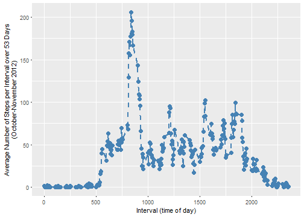
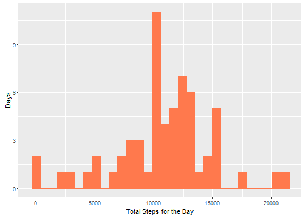

<hr>

# Introduction
This report presents the analysis of data from personal activity monitoring devices such as the [Fitbit][1], [Nike Fuelband][2], or [Jawbone Up][3]. The data provided will be used to evaluate temporal patterns of recorded daily activity (i.e., walking/steps).

The study objectives are:

1. Import and clean the data (if necessary)
2. Examine mean total number of steps per day
3. Examine the average daily activity pattern
4. Demonstrate imputing missing values and the effect of this on the results
5. Examine differences in activity patterns between weekdays and weekends

<hr>

# Methods and Results
The R programming language was used to import, process, evaluate the data and present the results with regard to the stated objectives. The methods used in, and results of these analyses are described and presented in the following sections.


## Loading and Preprocessing the Data
The following R code unzips the file and imports the personal activity monitoring data.


```r
unzip("activity.zip")
fitData<-read.csv("activity.csv",stringsAsFactors=FALSE)
```

Using package lubridate to convert date strings to POSIXct and create fields for year, month and day.


```r
newdates<-strptime(fitData$date,format="%Y-%m-%d")
fitData$date<-as.POSIXct(newdates)
fitData$Year<-year(fitData$date)
fitData$Month<-month(fitData$date,abbr=FALSE,label=TRUE)

fitData$Day<-wday(fitData$date,abbr=FALSE,label=TRUE)
fitData<-as_tibble(fitData)
head(fitData)
```

```
## # A tibble: 6 x 6
##   steps date                interval  Year Month   Day   
##   <int> <dttm>                 <int> <dbl> <ord>   <ord> 
## 1    NA 2012-10-01 00:00:00        0 2012. October Monday
## 2    NA 2012-10-01 00:00:00        5 2012. October Monday
## 3    NA 2012-10-01 00:00:00       10 2012. October Monday
## 4    NA 2012-10-01 00:00:00       15 2012. October Monday
## 5    NA 2012-10-01 00:00:00       20 2012. October Monday
## 6    NA 2012-10-01 00:00:00       25 2012. October Monday
```

```r
summary(fitData$steps)
```

```
##    Min. 1st Qu.  Median    Mean 3rd Qu.    Max.    NA's 
##    0.00    0.00    0.00   37.38   12.00  806.00    2304
```


## Mean Total Steps per Day
**Question.  **What is the mean of total number of steps taken per day?

**Instructions.  **For this part of the assignment, you can ignore the missing values in the dataset.

1. Calculate the total number of steps taken per day
2. If you do not understand the difference between a histogram and a barplot, research the difference between them. Make a histogram of the total number of steps taken each day
3. Calculate and report the mean and median of the total number of steps taken per day

**Figure 1.  **Histogram of total number of daily steps over 53 days. NA values have been removed.

```r
histData<-filter(fitData,!is.na(steps))
histData<-histData %>% group_by(date) %>% 
        summarize(totalDailySteps = sum(steps))
h<-ggplot(histData,aes(totalDailySteps))+
        geom_histogram(bins = 30,fill="#ff794d",color="#ff794d")+
        labs(y="Days", x = "Total Steps for the Day")
h
```

<!-- -->


**Table 1.**Summary statistics for total steps taken per day over 53 days. NA values have been removed.

```r
stepSum<-filter(fitData,!is.na(steps))
stepSum<-stepSum %>% group_by(date) %>% 
        summarize(totalDailySteps = sum(steps))
stepSum<-mosaic::favstats(stepSum$totalDailySteps)


kable(stepSum,format="markdown",align = "c",col.names = c('Minimum',
                '1st Quartile','Median','3rd Quartile','Maximum','Mean',
                 'Std. Deviation','Valid Measurements','NA Values'))
```


|   | Minimum | 1st Quartile | Median | 3rd Quartile | Maximum |   Mean   | Std. Deviation | Valid Measurements | NA Values |
|:--|:-------:|:------------:|:------:|:------------:|:-------:|:--------:|:--------------:|:------------------:|:---------:|
|   |   41    |     8841     | 10765  |    13294     |  21194  | 10766.19 |    4269.18     |         53         |     0     |

The results in **Table 1** show a mean value for total daily steps of 10,766 and a median value of 10,765. This result agrees with the histogram in **Figure 2**. The closeness of the mean and median values indicates a very normally distributed dataset.

## Average Daily Activity Pattern
**Question.  **What is the average daily activity pattern?

**Instructions.  **

1. Make a time series plot (i.e. type = "l") of the 5-minute interval (x-axis) and the average number of steps taken, averaged across all days (y-axis).

2. Which 5-minute interval, on average, across all the days in the dataset, contains the maximum number of steps?

**Figure 2.  **Time series plot of average steps per daily interval, averaged over two months.

```r
tsData<-filter(fitData,!is.na(steps)) %>% 
        group_by(interval) %>% 
        summarize(N = length(steps),aveSteps=mean(steps))

t<-ggplot(tsData,aes(x=interval,y=aveSteps))+
        geom_point(color="steelblue",size=3)+
        geom_line(color="steelblue",linetype="dashed",size=.75)+
        labs(y="Average Number of Steps per Interval over 53 Days\n(October-November 2012)",
             x="Interval (time of day)")
t
```

<!-- -->

The most active time interval of the day within the two month period appears to be between minute intervals 750 and 1000. There are 1440 minutes in a day and the data set contains 2355 intervals per day meaning each interval is aproximately 37 seconds. These intervals of highest activity in **Figure 2** then represent approximately the 8th and 10th hours of the day (8 am and 10 am).

The daily time interval containing the maximum number of steps on average is described as folows:

**Table 2.  **The daily interval containing the maximum average number of steps. 

```r
kable(filter(tsData,aveSteps==max(aveSteps)),format="markdown", align = 'c',
      col.names = c('Interval','Number of Days Measured','Average Steps'))
```


| Interval | Number of Days Measured | Average Steps |
|:--------:|:-----------------------:|:-------------:|
|   835    |           53            |   206.1698    |

The interval containing the maximum average number of daily steps is the 835 interval, corresponding approximately to the 8.7th hour, or about 840 am. This pattern could represent a walking or cycling morning commute. However, it is not repeated at the end of the day, so it may be more likely that this represents a workout routine.


## Imputing Missing Values
**Objective.  **Impute some meaningful values for the missing values (i.e., NAs) in the dataset to answer the questions.

**Instructions.  **

1. Calculate and report the total number of missing values in the dataset (i.e. the total number of rows with NAs).

**Table 3.  **Summary statistics for valid step measurements, and number of NA values.

```r
sum<-mosaic::favstats(fitData$steps)
kable(sum,format="markdown",align = 'c', col.names = c('Minimum',
                '1st Quartile','Median','3rd Quartile','Maximum','Mean',
                 'Std. Deviation','Valid Measurements','NA Values'))
```


|   | Minimum | 1st Quartile | Median | 3rd Quartile | Maximum |  Mean   | Std. Deviation | Valid Measurements | NA Values |
|:--|:-------:|:------------:|:------:|:------------:|:-------:|:-------:|:--------------:|:------------------:|:---------:|
|   |    0    |      0       |   0    |      12      |   806   | 37.3826 |    111.9955    |       15264        |   2304    |

The number of NA values in the dataset is 2,304 out of 17568 or 13.1 percent of the data.

2. Devise a strategy for filling in all of the missing values in the dataset. The strategy does not need to be sophisticated. For example, you could use the mean/median for that day, or the mean for that 5-minute interval, etc.

The selected strategy is to calculate the average number of steps taken in each interval by day of the week. Then, these values will be substituted into the dataset for the NA values by day of the week and interval using the 'join' function in dplyr.


```r
#Create the data to use for imputation
impData<-filter(fitData,!is.na(steps))
impData<-impData %>% group_by(Day,interval) %>% 
        summarize(numObs = length(steps),dayIntAve = mean(steps))
head(impData,10)
```

```
## # A tibble: 10 x 4
## # Groups:   Day [1]
##    Day    interval numObs dayIntAve
##    <ord>     <int>  <int>     <dbl>
##  1 Sunday        0      7      0.  
##  2 Sunday        5      7      0.  
##  3 Sunday       10      7      0.  
##  4 Sunday       15      7      0.  
##  5 Sunday       20      7      0.  
##  6 Sunday       25      7      7.43
##  7 Sunday       30      7      0.  
##  8 Sunday       35      7      0.  
##  9 Sunday       40      7      0.  
## 10 Sunday       45      7      0.
```

This dataframe holds the values that will be used to substitute the NA values in the full dataset.

3. Create a new dataset that is equal to the original dataset but with the missing data filled in.

The steps are as follows:


```r
#Split the dataset to isolate the NAs
toFill<-filter(fitData,is.na(steps))
aok<-filter(fitData,!is.na(steps))

#Merge in the values for imputation by weekday and interval
toFill<-left_join(toFill,impData, by = c('Day' = 'Day','interval' = 'interval'))

#Keep track of original vs imputed values
aok$REMARK<-'Original data'
toFill$REMARK<-'Imputed data'

#Fix up the imputed dataframe for appending back to the rest of the data
toFill$steps<-toFill$dayIntAve
toFill<-select(toFill,c("steps","date","interval","Year","Month","Day","REMARK"))

#Add back to the rest of the data
fitData2<-bind_rows(aok,toFill)
fitData2<-arrange(fitData2,date,interval)

head(fitData2,15)
```

```
## # A tibble: 15 x 7
##    steps date                interval  Year Month   Day    REMARK      
##    <dbl> <dttm>                 <int> <dbl> <ord>   <ord>  <chr>       
##  1  1.43 2012-10-01 00:00:00        0 2012. October Monday Imputed data
##  2  0.   2012-10-01 00:00:00        5 2012. October Monday Imputed data
##  3  0.   2012-10-01 00:00:00       10 2012. October Monday Imputed data
##  4  0.   2012-10-01 00:00:00       15 2012. October Monday Imputed data
##  5  0.   2012-10-01 00:00:00       20 2012. October Monday Imputed data
##  6  5.00 2012-10-01 00:00:00       25 2012. October Monday Imputed data
##  7  0.   2012-10-01 00:00:00       30 2012. October Monday Imputed data
##  8  0.   2012-10-01 00:00:00       35 2012. October Monday Imputed data
##  9  0.   2012-10-01 00:00:00       40 2012. October Monday Imputed data
## 10  0.   2012-10-01 00:00:00       45 2012. October Monday Imputed data
## 11  0.   2012-10-01 00:00:00       50 2012. October Monday Imputed data
## 12  0.   2012-10-01 00:00:00       55 2012. October Monday Imputed data
## 13  0.   2012-10-01 00:00:00      100 2012. October Monday Imputed data
## 14  0.   2012-10-01 00:00:00      105 2012. October Monday Imputed data
## 15  0.   2012-10-01 00:00:00      110 2012. October Monday Imputed data
```

Looks like the 2,304 NA values have been substituted with the average value for each weekday and interval.

4. Make a histogram of the total number of steps taken each day and Calculate and report the mean and median total number of steps taken per day. Do these values differ from the estimates from the first part of the assignment? What is the impact of imputing missing data on the estimates of the total daily number of steps?

**Figure 3.  **Histogram of total number of daily steps over 61 days. NA values have been imputed with the corresponding average calculated value for each weekday and interval.

```r
histData2<-fitData2 %>% group_by(date) %>% 
        summarize(totalDailySteps = sum(steps))
h2<-ggplot(histData2,aes(totalDailySteps))+
        geom_histogram(bins = 30,fill="#ff794d",color="#ff794d")+
        labs(y="Days", x = "Total Steps for the Day")
h2
```

<!-- -->

The histogram is not largely different in configuration than the histogram shown in **Figure 1**. The number of days with total steps in the 10,000 to 11,000 range has increased slightly. 
**Table 4.  **Summary statistics for total steps taken per day over 61 days with NA values imputed, vs. a 53 day period where the NA values were removed. NA values were imputed with the corresponding average calculated value for each weekday and interval.


```r
#Removing the NAs
stepSum<-filter(fitData,!is.na(steps))
stepSum<-stepSum %>% group_by(date) %>% 
        summarize(totalDailySteps = sum(steps))
stepSum<-mosaic::favstats(stepSum$totalDailySteps)
stepSum$Method<-'NAs Removed'
row.names(stepSum)<-NULL

#With inputation
stepSum2<-fitData2 %>% group_by(date) %>% 
        summarize(totalDailySteps = sum(steps))
stepSum2<-mosaic::favstats(stepSum2$totalDailySteps)
stepSum2$Method<-'NAs Imputed'
row.names(stepSum2)<-NULL

stepSum3<-rbind(stepSum,stepSum2)


kable(stepSum3,format="markdown",align = "c",col.names = c('Minimum',
                '1st Quartile','Median','3rd Quartile','Maximum','Mean',
                 'Std. Deviation','Valid Measurements','NA Values','Method'))
```


| Minimum | 1st Quartile | Median | 3rd Quartile | Maximum |   Mean   | Std. Deviation | Valid Measurements | NA Values |   Method    |
|:-------:|:------------:|:------:|:------------:|:-------:|:--------:|:--------------:|:------------------:|:---------:|:-----------:|
|   41    |     8841     | 10765  |    13294     |  21194  | 10766.19 |    4269.180    |         53         |     0     | NAs Removed |
|   41    |     8918     | 11015  |    12811     |  21194  | 10821.21 |    4014.304    |         61         |     0     | NAs Imputed |

The results in **Table 4** show a mean value for total daily steps of 10,821 and a median value of 11,015. This result agrees with the histogram in **Figure 3**. The closeness of the mean and median values still indicates a very normally distributed dataset after substituting NA values.

The effect of using imputed values versus removing the NA values is not a major one in this case.

## Compare Weekday and Weekend Activity
**Question.  **Are there differences in activity patterns between weekdays and weekends?

For this part the weekdays() function may be of some help here. Use the dataset with the filled-in missing values for this part.

**Instructions.  **

1. Create a new factor variable in the dataset with two levels – “weekday” and “weekend” indicating whether a given date is a weekday or weekend day.


```r
fitData2$DayType<-ifelse(fitData$Day %in% c('Saturday','Sunday'),"Weekend","Weekday") %>% 
        as.factor()
chk<-fitData2[,c('Day','DayType')]
unique(chk)
```

```
## # A tibble: 7 x 2
##   Day       DayType
##   <ord>     <fct>  
## 1 Monday    Weekday
## 2 Tuesday   Weekday
## 3 Wednesday Weekday
## 4 Thursday  Weekday
## 5 Friday    Weekday
## 6 Saturday  Weekend
## 7 Sunday    Weekend
```

Days have been assigned 'weekday' or 'weekend'.

2. Make a panel plot containing a time series plot (i.e. type = "l") of the 5-minute interval (x-axis) and the average number of steps taken, averaged across all weekday days or weekend days (y-axis). See the README file in the GitHub repository to see an example of what this plot should look like using simulated data.

**Figure 4.  **Time series plot of average steps per daily interval, averaged over two months, by weekend days and weekdays.

```r
tsData2<-fitData2 %>%
        group_by(DayType,interval) %>% 
        summarize(N = length(steps),aveSteps=mean(steps))

t<-ggplot(tsData2,aes(x=interval,y=aveSteps))+
        geom_point(color="steelblue",size=3)+
        geom_line(color="steelblue",linetype="dashed",size=.75)+
        facet_grid(DayType~.,switch = 'both')+
        labs(y="Average Number of Steps",
             x="Interval (time of day)")
t
```

<!-- -->

The high period of activity around 8-9 am seems to be present both on weekends and weekdays, with the higher average number of steps at this time of day ocuuring on the weekdays.

<hr>

# References

## Data Sources

* Dataset: [Activity monitoring data](https://d396qusza40orc.cloudfront.net/repdata%2Fdata%2Factivity.zip) [52K]

The variables included in this dataset are:

* **steps**: Number of steps taking in a 5-minute interval (missing
    values are coded as `NA`)

* **date**: The date on which the measurement was taken in YYYY-MM-DD
    format

* **interval**: Identifier for the 5-minute interval in which
    measurement was taken

## RMarkdown and CSS

* https://rmarkdown.rstudio.com/html_document_format.html#code_folding

* https://www.w3schools.com/html/html_css.asp

[1]: http://www.fitbit.com
[2]: http://www.nike.com/us/en_us/c/nikeplus-fuelband
[3]: https://jawbone.com/up
